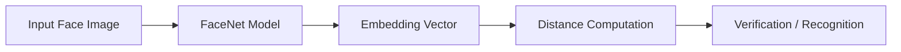
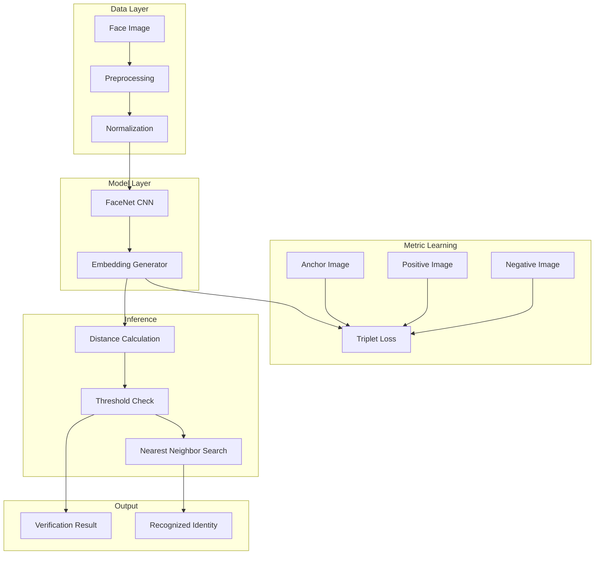

# Face Recognition using FaceNet and Triplet Loss

A deep learning project that implements a face recognition and verification system using the FaceNet architecture with Triplet Loss. The system learns discriminative facial embeddings to enable accurate identity verification and recognition through distance-based comparison.

---

## Overview

This repository demonstrates how metric learning enables face recognition by mapping images into a high-dimensional embedding space. Faces of the same identity cluster together, while different identities are separated using Triplet Loss.

---

## Features

- End-to-end face recognition and verification pipeline  
- Deep embedding generation using FaceNet  
- Triplet Loss for metric learning  
- Face verification against claimed identities  
- Face recognition via nearest-neighbor search  
- Modular and educational implementation  

---

## Model & Framework

- **Model**: FaceNet (Inception-based architecture)  
- **Framework**: TensorFlow with Keras backend  
- **Task**: Face Verification & Face Recognition  
- **Input Shape**: 96 × 96 × 3  
- **Output**: 128-dimensional embedding vector  

---

## System Architecture

### High-Level Pipeline


## Modular System Design



## Core Components

- **FaceNet Model**  
  Inception-based CNN for embedding generation  

- **Embedding Generator**  
  Converts face images into 128D vectors  

- **Triplet Loss**  
  Ensures separation between identities in embedding space  

- **Verification Module**  
  Confirms identity using distance threshold  

- **Recognition Module**  
  Identifies closest match using nearest-neighbor search  

---

## Loss Function

Triplet Loss minimizes the distance between anchor and positive embeddings while maximizing the distance from negative embeddings:

```text id="triplet-loss"
## Mathematical Formulation

$$
\[
L = \max\left(\|f(a) - f(p)\|^2 - \|f(a) - f(n)\|^2 + \alpha,\; 0\right)
\]
$$
```

## Training & Initialization

- Triplet Loss implemented using TensorFlow  
- Model compiled with Adam optimizer  
- Pretrained FaceNet weights used for initialization  

---

## Face Database

- Face images encoded into 128D embeddings  
- Stored as key-value pairs (identity → embedding)  
- Used for verification and recognition  

---

## Usage

### Face Verification
- **Input**: Image + claimed identity  
- **Output**: Match / No Match  

### Face Recognition
- **Input**: Image  
- **Output**: Closest matching identity  

---

## Inference Pipeline

1. Load input face image  
2. Preprocess and normalize  
3. Generate embedding using FaceNet  
4. Compute distance with stored embeddings  
5. Apply threshold or nearest-neighbor search  
6. Output result  

---

## Results & Outputs

- Identity match confirmation  
- Rejection for mismatched identities  
- Distance-based similarity scores  
- Recognized identity labels  

---

## Dependencies

- Python 3.x  
- TensorFlow  
- Keras  
- NumPy  
- OpenCV / PIL  

---

## References

- FaceNet: A Unified Embedding for Face Recognition and Clustering – Schroff et al.  
- DeepFace: Closing the Gap to Human-Level Performance – Taigman et al.  
- Keras-OpenFace Repository  
- FaceNet GitHub Repository  

---

## License

This project is intended for educational and research purposes.  
Free to use and modify with proper attribution.
